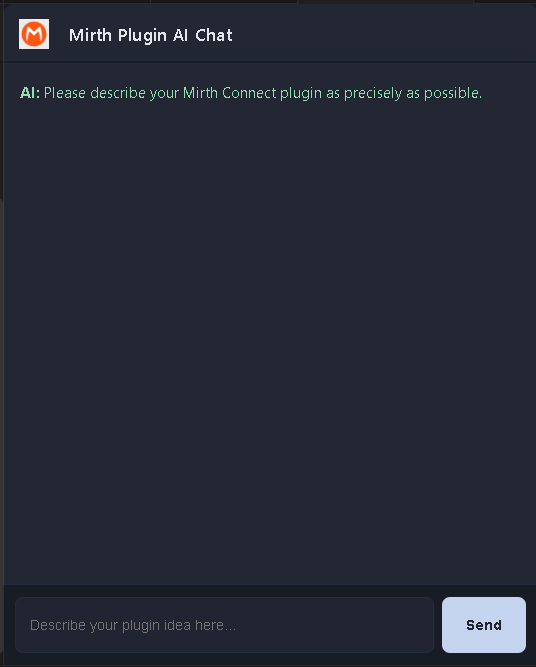

# Mirth Plugin AI Generator

**Version:** 0.1.5

**Publisher:** Daniel Zurmühle

This extension allows you to automatically generate a complete Mirth Connect plugin from within VSCode using a single prompt. All you need to do is enter a brief description (prompt), and the rest is handled in the background by a Python backend service.

---

## Getting Started

Enter the command `mirthPluginGen.openChat`.

---

This version provides a clear and concise description of what your extension does and how to get started with it. If you need further customization or additional details, feel free to let me know!

